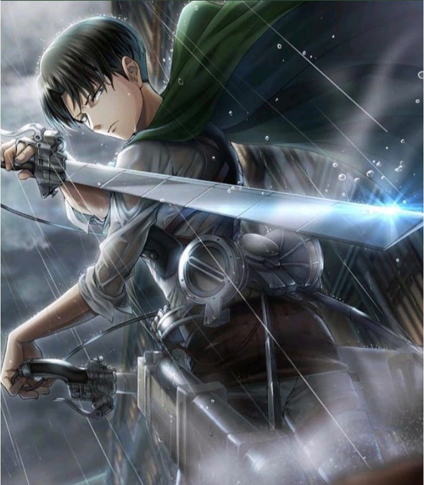

# Levi Ackerman - Tribute Site 🎯

A responsive and interactive tribute website dedicated to Levi Ackerman from Attack on Titan (Shingeki no Kyojin). This project showcases Levi's character, abilities, equipment, and family background with modern web design techniques.

## 🌟 Features

### ✨ Interactive Elements
- **Clickable Images** - Each image plays random Levi quotes with subtitles
- **Custom Cursor** - Unique cursor follower with hover effects
- **Smooth Animations** - GSAP-powered animations and transitions
- **Particle System** - Animated background particles
- **Skill Statistics** - Animated progress bars showing Levi's abilities

### 📱 Responsive Design
- Fully responsive layout for all devices
- Mobile-first approach
- Cross-browser compatibility
- Optimized for desktop, tablet, and mobile

### 🎨 Visual Design
- Modern gradient backgrounds
- Hover effects and transitions
- Custom scrollbar styling
- Loading screen with progress bar
- Interactive navigation

## 🗂️ Project Structure

